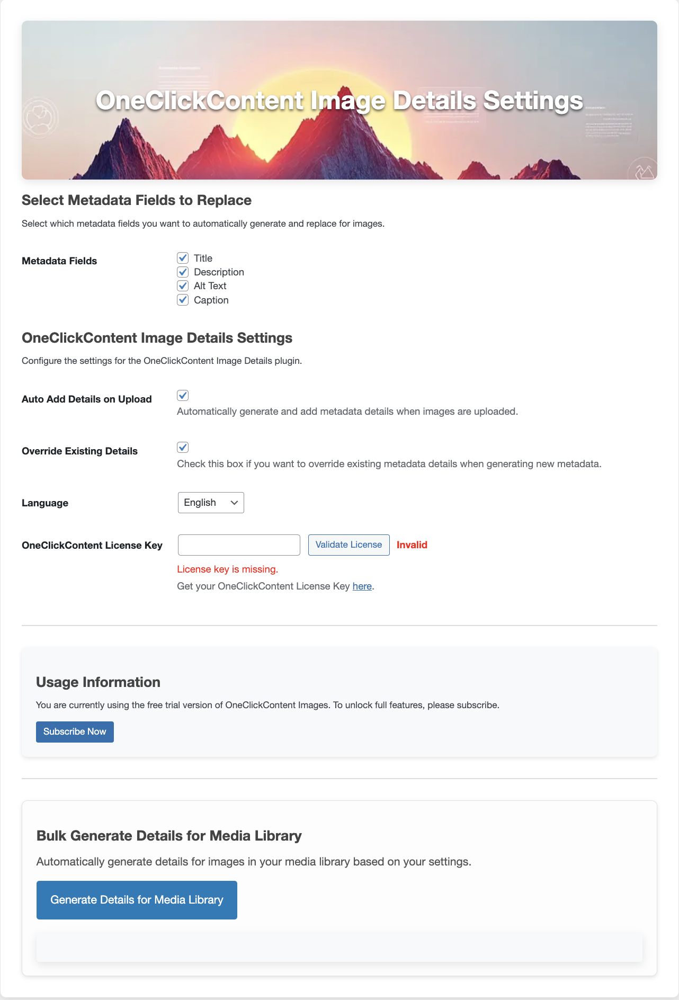
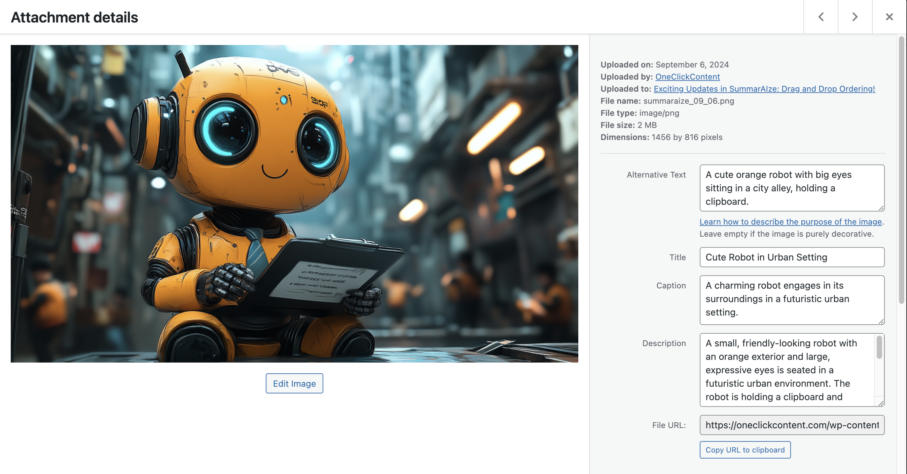
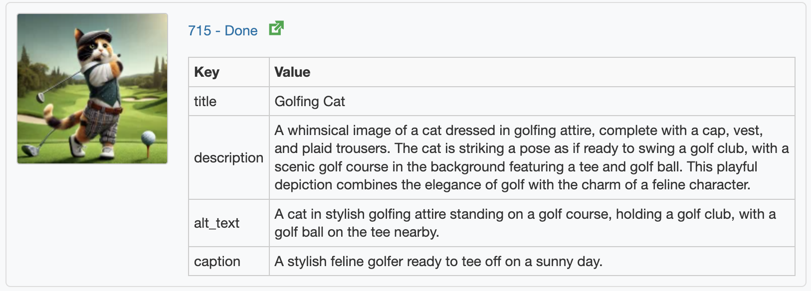
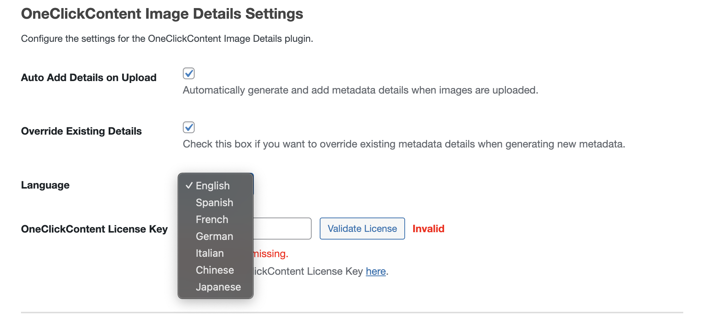

# OneClickContent - Image Detail Generator

**Contributors**: jwilson529  
**Donate link**: [Donate](https://oneclickcontent.com/donate)  
**Tags**: images, details, OpenAI, AI, accessibility  
**Requires at least**: 5.0  
**Tested up to**: 6.7  
**Requires PHP**: 7.2  
**Stable tag**: 1.1.9  
**License**: GPLv2 or later  
**License URI**: [GPLv2](https://www.gnu.org/licenses/gpl-2.0.html)  

Automatically generate image details like titles, descriptions, alt texts, and captions using OpenAI's GPT models, now with multilingual support.

---

## Description

**OneClickContent - Image Detail Generator** is a WordPress plugin that enhances your images by automatically generating details using AI technology. Improve your website's SEO and accessibility by adding descriptive titles, alt texts, captions, and descriptions to your images effortlessly.

### Features:

- **Automated Detail Generation**: Create image titles, descriptions, alt texts, and captions with a single click.
- **Auto Add on Upload**: Automatically generate details for images upon upload based on plugin settings.
- **Multilingual Support**: Generate details in multiple languages, including English, Spanish, French, German, Italian, Chinese, and Japanese.
- **Free Trial**: Process up to 5 images for free—no upfront subscription required.
- **License-Based Usage**: Use your **OneClickContent license key** to unlock unlimited detail generation.
- **Seamless Integration**: Easily accessible within the WordPress Media Library.
- **Improved Accessibility**: Enhance user experience for visitors using assistive technologies.
- **Bulk Editing**: Manage and generate details for multiple images at once via the Bulk Edit tab.

---

## Transparency

To provide detail generation, this plugin sends the following data to **oneclickcontent.com**:
- **Image Data**: Either the image itself or its URL.
- **Website URL**: Used for licensing and debugging.
- **License Key**: Used to verify your subscription.

From there, this data is processed by **OpenAI's GPT-4o-mini model** (or other models as we adapt to the latest advancements in AI) to generate details. This process is fully managed by **OneClickContent**, and you do not need an OpenAI API key.

---

## Installation

1. **Upload the Plugin**:
   - Upload the `oneclickcontent-images` folder to the `/wp-content/plugins/` directory.

2. **Activate the Plugin**:
   - Activate through the Plugins menu in WordPress.

3. **Configure Settings**:
   - Navigate to **Image Metadata** (under the admin menu).
   - Enter your **OneClickContent license key**.
   - Choose the desired language for detail generation.
   - Optionally enable **Auto Add Details on Upload** to generate details automatically during image uploads.

4. **Generate Details**:
   - Go to your **Media Library**.
   - Select an image and click the **"Generate Details"** button, or use the Bulk Edit tab for multiple images.

---

## Frequently Asked Questions

### Do I need an OpenAI API key to use this plugin?

No. The plugin handles all AI integration through **OneClickContent**. You only need a valid license key for extended usage beyond the free trial.

### What is the free trial?

The plugin allows you to generate details for up to 5 images for free. After the trial, you will need a valid license key from **oneclickcontent.com** to continue generating details.

### Which AI models are supported?

The plugin currently uses the GPT-4o-mini model but will adapt to the latest advancements in AI models to ensure optimal performance.

### Is my image data sent to OpenAI?

Yes, your image data (or URLs), along with your website URL and license key, is sent to **oneclickcontent.com** for processing and then forwarded to OpenAI for detail generation. You do not interact directly with OpenAI.

### Can I choose a specific language for details?

Yes! The plugin supports multiple languages, including English, Spanish, French, German, Italian, Chinese, and Japanese. Select your preferred language from the plugin's settings page.

### Can I edit the generated details?

Absolutely! After generation, you can review and edit the details in the Media Library or Bulk Edit tab before saving.

### What does "Auto Add Details on Upload" do?

If enabled, the plugin will automatically generate details for any images you upload to the Media Library, saving you time.

---

## Screenshots

1. **Settings Page**: Configure your OneClickContent license key, select a language, and enable auto detail generation on upload.
   

2. **Media Library Integration**: Generate details directly from the Media Library.
   

3. **Bulk Edit Tab**: Manage details for multiple images at once.
   

4. **Generated Details**: View and edit the generated details for your images.
   

5. **Language Selection**: Choose your preferred language for detail generation.
   

---

## Changelog

### 1.1.9
- Better Settings and Bulk Edit screen handling.

### 1.1.8
- Enhanced security with improved nonce verification across AJAX and form handling.
- Achieved full WordPress Coding Standards (WPCS) compliance, including Yoda conditions and superglobal sanitization.
- Optimized asset enqueuing with safer GET parameter handling using `filter_input()`.

### 1.1.7
- Fixed nonce issue in `get_thumbnail` AJAX call.

### 1.1.6
- Redirect to settings on activate.

### 1.1.5
- General fixes and improvements to the update system.
- Resolved issues with stale transients causing incorrect update indicators.
- Improved transient management to ensure updates are accurately reflected.
- Enhanced handling of plugin update checks with better validation and cleanup.

### 1.1.1
- Added multilingual support for detail generation (English, Spanish, French, German, Italian, Chinese, Japanese).
- Improved transparency regarding data sent to oneclickcontent.com and OpenAI.
- Simplified user requirements—no OpenAI API key needed.

### 1.1.0
- Added "Auto Add Details on Upload" feature to automatically generate details for uploaded images.

### 1.0.0
- Initial release of OneClickContent - Image Detail Generator.

---

## Upgrade Notice

### 1.1.8
- Security enhancements and WPCS compliance. Update for improved stability and best practices.

### 1.1.7
- Fixes nonce verification in thumbnail fetching for improved security.

### 1.1.5
- Fixes and enhancements to the update system. Resolves issues with stale update indicators and transient handling.

### 1.1.1
- Added multilingual support and improved transparency. Please review the updated plugin description.

### 1.1.0
- Added "Auto Add Details on Upload" feature.

### 1.0.0
- Initial release.

---

## License

This plugin is licensed under the GPLv2 or later.