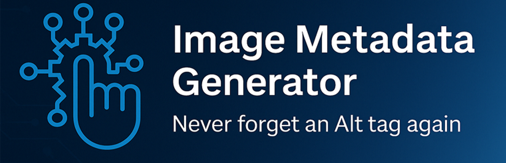

# 📄 OneClickContent – Image Detail Generator

**Generate SEO-optimized alt text, titles, captions, and descriptions for your WordPress images automatically.**  
Save time, improve accessibility, and boost search rankings — with one click.

---

## 🚀 Overview

**OneClickContent – Image Detail Generator** automatically enhances your WordPress images with AI-powered metadata.

Boost your SEO, improve accessibility, and save hours of manual editing by generating **alt text**, **titles**, **captions**, and **descriptions** automatically — powered by **OpenAI’s GPT-4o-mini model**.

**Perfect for:**  
✅ Bloggers  
✅ WooCommerce store owners  
✅ SEO agencies  
✅ Content creators  
✅ WordPress developers

---

## ✨ Key Benefits

- **SEO Optimization**: Boost your site's rankings in Google Search and Google Images.
- **Accessibility Compliance**: Meet WCAG and ADA accessibility standards automatically.
- **One-Click Simplicity**: Instantly generate metadata directly in your WordPress Media Library.
- **Multilingual Support**: Create metadata in English, Spanish, French, German, Italian, Chinese, and Japanese.
- **Bulk Editing**: Manage and optimize hundreds of images at once.
- **No OpenAI API Key Required**: Everything handled securely through the OneClickContent service.

---

## ⚙️ Features

- **Automatic Metadata Generation**: Titles, descriptions, alt texts, and captions.
- **Auto-Add on Upload**: Automatically generate metadata for newly uploaded images.
- **Bulk Edit Mode**: Generate details for multiple images at once.
- **Multilingual Capabilities**: 7 languages available.
- **Built-In Free Trial**: Process up to 5 images without a subscription.
- **License-Based Unlimited Use**: Unlock unlimited generation with a OneClickContent license key.

---

## 🔒 Transparency

To generate metadata, OneClickContent securely sends:
- Image data (file or URL)
- Website URL (for licensing and diagnostics)
- License key (for usage validation)

Processing is done securely through OpenAI models via OneClickContent servers.  
**You do not need your own OpenAI account or key.**

- [Terms of Service](https://oneclickcontent.com/terms/)  
- [Privacy Policy](https://oneclickcontent.com/privacy/)

---

## 🧩 External Services

- **Usage Verification API Endpoint**:  
  `https://oneclickcontent.com/wp-json/subscriber/v1/check-usage`

- **OpenAI Processing**: Metadata generation is powered by OpenAI GPT models via the OneClickContent API.

---

## 📦 Installation

1. **Upload the Plugin**
   - Upload the `occidg` folder to your `/wp-content/plugins/` directory.

2. **Activate**
   - Activate the plugin through your WordPress Plugins menu.

3. **Configure Settings**
   - Navigate to **Image Metadata** in the WordPress admin menu.
   - Enter your OneClickContent license key.
   - Select your preferred language.
   - (Optional) Enable **Auto Add on Upload** to generate metadata automatically.

4. **Generate Image Details**
   - Go to the WordPress **Media Library**.
   - Select an image and click **"Generate Details"**, or use the **Bulk Edit** tab for multiple images.

---

## ❓ Frequently Asked Questions

### Do I need an OpenAI API key?
No. All AI integration is handled by the OneClickContent servers. You only need a license key from [oneclickcontent.com](https://oneclickcontent.com).

### How does the free trial work?
You can generate metadata for **5 images** for free — no credit card, no signup required.

### Which AI model is used?
The plugin currently uses **OpenAI’s GPT-4o-mini** model for detail generation.

### Is my image data secure?
Yes. Data is transmitted securely, processed by OpenAI, and never retained unnecessarily.

### Can I edit the generated metadata?
Absolutely. You can edit titles, alt texts, captions, and descriptions manually after generation.

### Does it work with WooCommerce product images?
Yes! It’s perfect for optimizing product SEO automatically.

### What happens if I enable "Auto Add on Upload"?
Newly uploaded images will automatically have metadata generated without manual action.

### Which languages are supported?
Currently supported:
- English
- Spanish
- French
- German
- Italian
- Chinese
- Japanese

---

## 🖼️ Screenshots

1. **Settings Screen** – Configure license, language, and auto-add settings.
2. **Media Library Integration** – Generate metadata in one click.
3. **Bulk Edit Mode** – Manage multiple images at once.
4. **Generated Details View** – Preview and edit generated content.
5. **Language Selection Panel** – Choose metadata language easily.

> _Screenshots are available in the `/assets/` folder if using GitHub._

---

## 🛠️ Developers

- Source code available: [GitHub Repository](https://github.com/jwilson529/oneclickcontent-images)
- Built using:
  - **DataTables v2.2.2** + **Buttons v3.2.2** ([Source](https://github.com/DataTables/DataTablesSrc/releases/tag/2.2.2))

---

## 📜 License

This plugin is licensed under the [GPLv2 or later](https://www.gnu.org/licenses/gpl-2.0.html).

---

# 🎯 Short Summary
> "**OneClickContent – Instantly generate SEO-optimized image alt text, titles, captions, and descriptions in WordPress using GPT-4o. Save hours. Boost SEO. Improve accessibility.**"